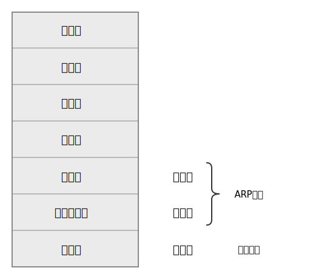
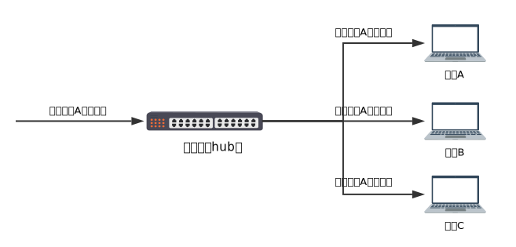
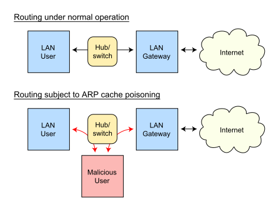

数据嗅探的两种实现方式

## OSI参考模型

## 基于混杂模式的嗅探

对于有集线器的局域网环境，将网卡设置为混杂模式即可实现窃听局域网数据包。原理就是集线器工作在物理层，只负责广播数据包，也就是发往某个地址的数据包会被广播到整个局域网。正常情况下局域网电脑的网络接口会遵循一个“君子协定” -- 只接收目的地址是自己或者广播地址的数据包，其他情况则丢弃该数据包。而工作在混杂模式下的网卡会接收所有数据包，不论是不是发给自己的。

## 基于arp欺骗的嗅探

交换机工作在数据链路层，所有与之相连的电脑都会被分配一个“端口”。交换机会将mac地址与端口做关联，这样发往某个地址的数据包会通过对应的端口直接发往目的主机，混杂模式就会失效。

arp投毒的原理就是当受害者与其他主机通信的时候，自己的arp缓存已经被恶意主机破坏，这时受害者做ip地址到mac地址转换的时候就会得到错误的mac地址，具体就是本来发往其他主机的数据包却发到了恶意主机。达到的效果就是恶意用户充当中间人，能够获取受害者与其他主机通信的数据内容。

